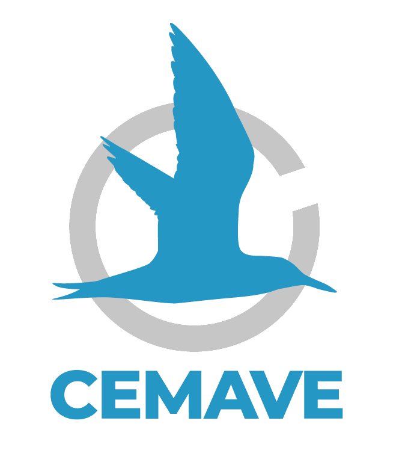

```{r setup, include=FALSE}
library(flexdashboard)
```

```{r libraries, warning = FALSE, message = FALSE}

library(tidyverse)
library(data.table)
library(descr)
library(RColorBrewer)
library(hrbrthemes)
library(kableExtra)
library(knitr)
library(htmltools)
library(htmlwidgets)
library(DT)
library(leaflet)
library(sf)
library(shiny)
library(plotly)
library(ggthemes)
library(forcats)
library(crosstalk)
#library(summarywidget)
library(rgdal)
library(foreign)
library(sp)
library(stringi)
library(readxl)


options(knitr.table.format = "html")
```

Áreas de Concentração de Aves Migratórias
=================

Input {.sidebar}
-----------------------------------------------------------------------

### 

</br>

</br>

```{r, echo=FALSE, fig.cap=" ", out.width = '50%', fig.align='center'}

#knitr::include_graphics("fig/capafinal.png")

```

<center>[{width=50% height=50%}](https://drive.google.com/drive/folders/109XnahlTtYhY9ycSj-RrOV_RTq-RjhB8?usp=sharing)</center>

<center>

[Baixar relatório (pdf)](https://drive.google.com/drive/folders/109XnahlTtYhY9ycSj-RrOV_RTq-RjhB8?usp=sharing)

[Relatório completo *on-line*](https://cemave-sede.github.io/relatorio_aves/)

</center>

</br>


```{r , echo=FALSE, fig.cap=" ", out.width = '80%', fig.align='center'}

#
```

<center>[{width=70% height=70%}](https://www.icmbio.gov.br/cemave/)</center>

</br>


```{r , echo=FALSE, fig.cap=" ", out.width = '70%', fig.align='center'}

#


```

<center>[{width=70% height=70%}](https://www.gov.br/icmbio/pt-br)</center>

</br>


```{r , echo=FALSE, fig.cap=" ", out.width = '70%', fig.align='center'}

#

```

<center>[{width=70% height=70%}](https://www.gov.br/mma/pt-br)</center>


</br>
</br>
</br>

<center>

Dúvidas e sugestões:
cemave.sede@icmbio.gov.br

</center>

Column {data-width=800}
-----------------------------------------------------------------------

### Áreas de Concentração 

```{r leitura e pré-processamento de dados, include = FALSE}

# Leitura de bases de dados

#ameacadas <- read.csv2("data/ameacadas.csv")
ameacadas <- read.csv2("data/Tabela_7.5.csv", header = TRUE, encoding = "UTF-8")
marinhas_costeiras <- read.csv2("data/Tabela_8.1.csv", header = TRUE, encoding = "UTF-8")
#areas_importantes <-  readOGR("data/AI/AI_riqueza_X_AI_concentracao.shp", verbose = FALSE)
#riqueza <-  readOGR("data/Riqueza/AI_riqueza.shp", verbose = FALSE)
concentracao <- readOGR("data/shapes/Areas_de_Concentracao.shp", verbose = FALSE)
ucs_federais <- readOGR("data/shapes/LimiteUCsFederais_052023_p.shp", verbose = FALSE)
#ucf_integral <-  readOGR("data/UC/UC_fed_junho_2020_PI.shp", verbose = FALSE)
#ucf_sustentavel <-  readOGR("data/UC/UC_fed_junho_2020_US.shp", verbose = FALSE)
spp_ameacadas <- readOGR("data/shapes/Areas_Ameacadas.shp", verbose = FALSE)
#TI_homologadas <-  readOGR("data/TI_homo/ti_sirgas.shp", verbose = FALSE)
# iba <-  readOGR("data/IBA/Ibas.shp", verbose = FALSE)
aerogeradores <-  readOGR("data/shapes/Aerogeradores.shp", verbose = FALSE)
grade_aerogeradores <-  readOGR("data/shapes/Grad_x_Aerogeradores.shp", verbose = FALSE)

#View(marinhas_costeiras)
# ----------------------------

# Ajustes de acentuação

Encoding(aerogeradores$NOME_EOL) <- "UTF-8"
Encoding(aerogeradores$PROPRIETAR) <- "UTF-8"
Encoding(aerogeradores$OPERACAO) <- "UTF-8"

# Encoding(ameacadas$nome) <- "UTF-8"

# Encoding(ucf_integral$nome) <- "UTF-8"
# Encoding(ucf_integral$municipios) <- "UTF-8"
# Encoding(ucf_integral$biomaIBGE) <- "UTF-8"
# Encoding(ucf_sustentavel$nome) <- "UTF-8"
# Encoding(ucf_sustentavel$municipios) <- "UTF-8"
# Encoding(ucf_sustentavel$biomaIBGE) <- "UTF-8"


```


```{r construção dos mapas}


mapa <- leaflet() %>%
  # Base groups
  setView(lng = -58, lat = -14,
          zoom = 4) %>%
 
  addProviderTiles(providers$Esri.WorldImagery, group = "Imagem ESRI") %>%
  addProviderTiles(providers$OpenStreetMap.Mapnik, group = "Open Street Map") %>%
  #addProviderTiles(providers$Stamen.TonerLite, group = "Stamen Toner Lite") %>%
  # Overlay groups
  # addPolygons(data = areas_importantes,
  #             color = "#96390e",
  #             weight = 1,
  #             group = "Área importante para aves") %>%
  # addPolygons(data = riqueza,
  #             color = "#3c39db",
  #             weight = 1,
  #             group = "Riqueza de aves") %>%
  addPolygons(data = concentracao,
            color = "#006400",
            weight = 1,
            group = "Área de concentração de aves") %>%
            # popup = paste("Área: ", N_concentracao$Nome, "<br>",
            #               "UF: ", N_concentracao$estado, "<br>",
            #               "Descrição: ", N_concentracao$Descricao, "<br>",
            #               "Fonte(s): ", N_concentracao$Fontes, "<br>")) %>%
  addPolygons(data = spp_ameacadas,
                   color = "#FF0000",
                   weight = 1,
                   group = "Ocorrência de espécies de aves ameaçadas") %>%
addPolygons(data = ucs_federais,
            color = "#fc7303",
            weight = 1,
            group = "UCs Federais",
            popup = paste("CNUC: ", ucs_federais$Cnuc, "<br>",
                          "Nome: ", ucs_federais$NomeUC, "<br>",
                          "Ano de criação: ", ucs_federais$CriacaoAno, "<br>",
                          "UF: ", ucs_federais$UFAbrang, "<br>",
                          "Bioma: ", ucs_federais$BiomaIBGE, "<br>",
                          "Grupo: ", ucs_federais$GrupoUC, "<br>")) %>%
# addPolygons(data = ucf_integral,
#             color = "#fc7303",
#             weight = 1,
#             group = "UC federal de uso sustentável",
#             popup = paste("Nome: ", ucf_integral$nome, "<br>",
#                           "Ano de criação: ", ucf_integral$anoCriacao, "<br>",
#                           "Área (ha): ", ucf_integral$areaHa, "<br>",
#                           "UF: ", ucf_integral$UF, "<br>",
#                           "Municípios: ", ucf_integral$municipios, "<br>",
#                           "Bioma: ", ucf_integral$biomaIBGE, "<br>",
#                           "CNUC: ", ucf_integral$codigoCnuc, "<br>")) %>%
# addPolygons(data = ucf_sustentavel,
#             color = "#158c35",
#             weight = 1,
#             group = "UC federal de proteção integral",
#             popup = paste("Nome: ", ucf_sustentavel$nome, "<br>",
#                           "Ano de criação: ", ucf_sustentavel$anoCriacao, "<br>",
#                           "Área (ha): ", ucf_sustentavel$areaHa, "<br>",
#                           "UF: ", ucf_sustentavel$UF, "<br>",
#                           "Municípios: ", ucf_sustentavel$municipios, "<br>",
#                           "Bioma: ", ucf_sustentavel$biomaIBGE, "<br>",
#                           "CNUC: ", ucf_sustentavel$codigoCnuc, "<br>")) %>%
  # addPolygons(data = TI_homologadas,
  #             color = "#fc7303",
  #             weight = 1,
  #             group = "Terra indígena homologada",
  #             popup = paste("Terra Indígena: ",  TI_homologadas$terrai_nom)) %>%
  # addPolygons(data = iba,
  #             color = "#FFFFFF",
  #             weight = 1,
  #             group = "IBA (Important Bird Area)") %>%
  addCircleMarkers(data = aerogeradores,
                 color = "#8B4513",
                radius = 3,
                  weight = 1,
                 group = "Aerogeradores",
                 popup = paste("Nome: ", aerogeradores$NOME_EOL, "<br>",
                           "Empresa: ", aerogeradores$PROPRIETAR, "<br>",
                            "Em operação: ", aerogeradores$OPERACAO, "<br>",
                            "Altura total (m): ", aerogeradores$ALT_TOTAL, "<br>",
                            "UF: ", aerogeradores$UF, "<br>")) %>%
  addPolygons(data = grade_aerogeradores,
               color = "#F4A460",
               weight = 1,
               group = "Grade Aerogeradores")  %>%

  # Layers Control
  addLayersControl((
    baseGroups = c("Open Street Map",
                   #"Stamen Toner Lite"
                   "Imagem ESRI")
    ),
    overlayGroups = c(#"Área importante para aves",
                      #"Riqueza de aves",
                      "Área de concentração de aves",
                      "Ocorrência de espécies de aves ameaçadas",
                      "UCs Federais",
                      "Aerogeradores",
                      "Grade Aerogeradores"
                    
                      #"UC federal de uso sustentável",
                      #"UC federal de proteção integral"
                      #"Terra indígena homologada",
                      #"IBA (Important Bird Area)"
                      #"Empreendimento eólico"
                      ),
        options = layersControlOptions(collapsed = TRUE, autoZIndex = TRUE)) %>%
  addEasyButton(easyButton(
    icon="fa-globe", title="Zoom to Level 4",
    onClick=JS("function(btn, map){ map.setZoom(4); }"))) %>% 
  addMeasure(
    position = "bottomleft",
    primaryLengthUnit = "m",
    primaryAreaUnit = "m2",
    activeColor = "#3D535D",
    completedColor = "#7D4479")

  
mapa %>% hideGroup(c("Aerogeradores", "Ocorrência de espécies de aves ameaçadas",
                      "Grade Aerogeradores", "UCs Federais"))


```


Column {data-width=200}
-----------------------------------------------------------------------

### Espécies de aves no Brasil

```{r}

valueBox(1971, icon = "fas fa-crow", color = "#006400")
```

### Táxons de aves ameaçados no Brasil

```{r}

valueBox(234, icon = "fas fa-kiwi-bird", color = "#F7B4B4")
```

### Espécies consideradas migratórias

```{r}

valueBox(176, icon = "fas fa-dove", color = "#F7F1B4")
```

### Espécies de aves migratórias ameaçadas

```{r}

valueBox(16, icon = "fas fa-kiwi-bird", color = "#F7B4B4")
```


### Áreas identificadas como locais de agregação de aves migratórias no Brasil, distribuídas em

```{r}

valueBox(58, icon = "fa fa-binoculars", color = "#006400")
```

### Unidades Federativas 

```{r}

valueBox(19, icon = "fa-object-group", color = "#85B5F0")
```

### Km^2^ priorizados como Áreas de Concentração de Aves Migratórias no Brasil


```{r}


valueBox(737000, icon = "fas fa-map", color = "#F7F1B4")
```


```{r}

#valueBox(158760, icon = "fa-map")
```


Espécies de Aves Ameaçadas
===============================

Column {data-width=500}
-----------------------------------------------------------------------

### **Locais de ocorrência de espécies de aves ameaçadas de extinção**


```{r mapa das espécies ameaçadas de extinção}


mapa <- leaflet() %>%
  #Base groups
  setView(lng = -58, lat = -14,
          zoom = 4) %>%
  addProviderTiles(providers$Esri.WorldImagery, group = "Imagem ESRI") %>%
  #addProviderTiles(providers$Stamen.TonerLite, group = "Stamen Toner Lite") %>%
  addProviderTiles(providers$OpenStreetMap.Mapnik, group = "Open Street Map") %>%

  #Overlay groups
  # addPolygons(data = areas_importantes,
  #             color = "#96390e",
  #             weight = 1,
  #             group = "Área importante para aves") %>%
#   addPolygons(data = riqueza,
#               color = "#3c39db",
#               weight = 1,
#               group = "Riqueza de aves") %>%
# addPolygons(data = concentracao,
#             color = "#006400",
#             weight = 1,
#             group = "Área de concentração de aves") %>%
#             # popup = paste("Área: ", N_concentracao$Nome, "<br>",
#             #               "UF: ", N_concentracao$estado, "<br>",
#             #               "Descrição: ", N_concentracao$Descricao, "<br>",
#             #               "Fonte(s): ", N_concentracao$Fontes, "<br>")) %>%
  addPolygons(data = spp_ameacadas,
                   color = "#FF0000",
                   weight = 1,
                   group = "Ocorrência de espécies de aves ameaçadas") %>%
# addPolygons(data = ucf_integral,
#             color = "#fc7303",
#             weight = 1,
#             group = "UC federal de uso sustentável",
#             popup = paste("Nome: ", ucf_integral$nome, "<br>",
#                           "Ano de criação: ", ucf_integral$anoCriacao, "<br>",
#                           "Área (ha): ", ucf_integral$areaHa, "<br>",
#                           "UF: ", ucf_integral$UF, "<br>",
#                           "Municípios: ", ucf_integral$municipios, "<br>",
#                           "Bioma: ", ucf_integral$biomaIBGE, "<br>",
#                           "CNUC: ", ucf_integral$codigoCnuc, "<br>")) %>%
# addPolygons(data = ucf_sustentavel,
#             color = "#158c35",
#             weight = 1,
#             group = "UC federal de proteção integral",
#             popup = paste("Nome: ", ucf_sustentavel$nome, "<br>",
#                           "Ano de criação: ", ucf_sustentavel$anoCriacao, "<br>",
#                           "Área (ha): ", ucf_sustentavel$areaHa, "<br>",
#                           "UF: ", ucf_sustentavel$UF, "<br>",
#                           "Municípios: ", ucf_sustentavel$municipios, "<br>",
#                           "Bioma: ", ucf_sustentavel$biomaIBGE, "<br>",
#                           "CNUC: ", ucf_sustentavel$codigoCnuc, "<br>")) %>%
  # addPolygons(data = TI_homologadas,
  #             color = "#fc7303",
  #             weight = 1,
  #             group = "Terra indígena homologada",
  #             popup = paste("Terra Indígena: ",  TI_homologadas$terrai_nom)) %>%
  # addPolygons(data = iba,
  #             color = "#73193F",
  #             weight = 1,
  #             group = "IBA (Important Bird Area") %>%
  addCircleMarkers(data = aerogeradores,
                 color = "#8B4513",
                 radius = 3,
                 weight = 1,
                 group = "Aerogeradores",
                 
                 popup = paste("Nome: ", aerogeradores$NOME_EOL, "<br>",
                           "Empresa: ", aerogeradores$PROPRIETAR, "<br>",
                            "Em operação: ", aerogeradores$OPERACAO, "<br>",
                            "Altura total (m): ", aerogeradores$ALT_TOTAL, "<br>",
                            "UF: ", aerogeradores$UF, "<br>")) %>%
    # addPolygons(data = grade_aerogeradores,
    #            color = "#F4A460",
    #            weight = 1,
    #            group = "Grade Aerogeradores")  %>%

  # Layers Control
  addLayersControl((
    baseGroups = c("Open Street Map",
                   #"Stamen Toner Lite (default)"
                   "Imagem ESRI")),
    overlayGroups = c(#"Área importante para aves",
                      # "Riqueza de aves",
                      # "Área de concentração de aves",
                      "Ocorrência de espécies de aves ameaçadas",
                      # "Grade Aerogeradores",
                      "Aerogeradores"
                      #"UC federal de uso sustentável",
                      #"UC federal de proteção integral"
                      #"Terra indígena homologada",
                      #"IBA (Important Bird Area)",
                      #"Empreendimento eólico"
                      ),
        options = layersControlOptions(collapsed = TRUE, autoZIndex = TRUE)) %>%
  addEasyButton(easyButton(
    icon="fa-globe", title="Zoom to Level 4",
    onClick=JS("function(btn, map){ map.setZoom(4); }"))) %>% 
  addMeasure(
    position = "bottomleft",
    primaryLengthUnit = "meters",
    primaryAreaUnit = "sqmeters",
    activeColor = "#3D535D",
    completedColor = "#7D4479")

   
mapa %>% hideGroup("Aerogeradores")


```

Column {data-width=500}
-----------------------------------------------------------------------

### **Percentual de células com registros na solução de priorização pelo Zonation por espécie.**

</br>


```{r gráficos concentração por estados e por região}

tab_ameacadas <- datatable(ameacadas,
                           caption = 'Tabela 7.2. Percentual de células com registros por espécie remanescente na solução de priorização pelo Zonation, considerando a priorização de 7% das células, ordenadas pelas espécies menos comuns. Para maiores informações, veja capítulo 7 do "Relatório de Áreas de Concentração de Aves Migratórias no Brasil".',

                           colnames = c('Espécie', 'Categoria', 'Nº de células com
registros pré priorização', '% de células com
registro na solução'),
                          
                           extensions = 'Buttons',
                           elementId = NULL,
                           #extensions= "Scroller",
                           style="bootstrap",
                           class="stripe hover",
                           width="80%",
                           rownames = F,
                           autoHideNavigation = T,
                           escape =FALSE,
                           filter = "top",
                           options=list(deferRender=TRUE,
                                   pageLength = 25,
                                   scrollY=300,
                                   dom = 'Bfrtip', 
                         buttons = c('copy', 'csv', 'excel', 'pdf'))) %>% 
    
formatStyle('Especie',  fontWeight = 'italic', fontStyle = 'italic', `text-align` = 'left') %>% 
    
formatStyle(columns = c("Categoria"), `text-align` = 'center') %>%
formatStyle(columns = c("NCPP"), `text-align` = 'center') %>%
formatStyle(columns = c("X.CRS"), `text-align` = 'center')


tab_ameacadas


#install.packages('kableExtra')
# library(kableExtra)
# library(tidyverse)
# 
# 
# 
#  kbl(ameacadas,
#              booktabs = TRUE,
#              longtable = TRUE,
#              align = "lccc",
#              caption = '',
#              col.names = c('Espécie', 'Categoria', 'Nº de células com
# registros pré priorização', '% de células com
# registro na solução')) %>%
#              column_spec(1, italic = TRUE) %>%
# kable_styling(full_width = F, bootstrap_options = c("striped", "hover",  "responsive")) %>%
#              column_spec(2, width = "3cm") %>%
#              column_spec(3, width = "5cm") %>%
#              column_spec(4, width = "5cm")
#footnote(number = c(""))


```


Aves Migratórias Marinhas e Costeiras
====================

Column 1 {data-width=500}
-------------------------

### **Espécies de aves migratórias marinhas e costeiras de interesse para os Complexos Eólicos *Offshore* no Brasil**

```{r tabela espécies marinhas migratórias}

tab_marinhas_costeiras <- datatable(marinhas_costeiras,
                           caption = 'Tabela 8.1. Espécies de aves marinhas e costeiras de interesse para os Complexos Eólicos Offshore no Brasil. [1. Status global de conservação segue classificação da IUCN (2020) e o nacional segue MMA (2014) 2. As espécies vagantes foram excluídas, pois têm baixa probabilidade de impacto oriundo dos CEOs e baixo risco presumível.] Para maiores informações, veja capítulo 8 do "Relatório de Áreas de Concentração de Aves Migratórias no Brasil".',
                            
                           colnames = c('Táxon', 'Nome comum', 'Família', 'Status global', 'Status nacional', 'Área de ocorrência predominante', 'Habitat', 'Status migratório', 'Impacto potencial / Risco presumido'),
                          
                           extensions = 'Buttons',
                           elementId = NULL,
                           # extensions= "Scroller",
                           style="bootstrap",
                           class="stripe hover",
                           width="80%",
                           rownames = F,
                           autoHideNavigation = T,
                           escape =FALSE,
                           filter = "top",
                           options=list(deferRender=TRUE,
                                   pageLength = 15,
                                   scrollY=300,
                                   dom = 'Bfrtip', 
                         buttons = c('copy', 'csv', 'excel', 'pdf'))) %>% 
    
formatStyle('Táxon',  fontWeight = 'italic', fontStyle = 'italic', `text-align` = 'left') %>% 
    
formatStyle(columns = c("Nome.comum"), `text-align` = 'left') %>%
formatStyle(columns = c("Familia"), `text-align` = 'center') %>%
formatStyle(columns = c("Status.global"), `text-align` = 'center') %>%
formatStyle(columns = c("Status.nacional"), `text-align` = 'center') %>%
formatStyle(columns = c("Área.de.ocorrência.predominante"), `text-align` = 'center') %>%
formatStyle(columns = c("Habitat"), `text-align` = 'center') %>%
formatStyle(columns = c("Status.migratório"), `text-align` = 'center') %>%
formatStyle(columns = c("Impacto.potencial...Risco.presumido"), `text-align` = 'center') %>%
formatStyle(columns = c("Status.nacional"), `text-align` = 'center')

tab_marinhas_costeiras

# formattable(ameacadas, 
#             align =c("l","l","c"), list(`Especie` = formatter("span", style = ~ style(color = "grey",font.style = "italic"))))


#install.packages('kableExtra')
# library(kableExtra)
# library(tidyverse)
# 
# 
# 
#  kbl(ameacadas,
#              booktabs = TRUE,
#              longtable = TRUE,
#              align = "lccc",
#              caption = '',
#              col.names = c('Espécie', 'Categoria', 'Nº de células com
# registros pré priorização', '% de células com
# registro na solução')) %>%
#              column_spec(1, italic = TRUE) %>%
# kable_styling(full_width = F, bootstrap_options = c("striped", "hover",  "responsive")) %>%
#              column_spec(2, width = "3cm") %>%
#              column_spec(3, width = "5cm") %>%
#              column_spec(4, width = "5cm")
#footnote(number = c(""))


```


Riqueza de Morcegos
====================

Column 1 {data-width=500}
-------------------------

### **Riqueza de morcegos**

```{r  out.width = '70%', fig.align='center'}

library(raster)
library(RColorBrewer)
library(tidyverse)


morcegos <- raster("data/raster/morcegos/w001001.adf")
estados <- readOGR("data/shapes/estados_2010.shp", verbose = FALSE)
regioes <- readOGR("data/shapes/regioes_2010.shp", verbose = FALSE)


pal = colorNumeric(c("#313695", "#4575b4","#74add1", "#abd9e9", "#e0f3f8", "#ffffbf", "#fee090", "#fdae61", "#f46d43", "#d73027", "#a50026"), values(morcegos),  na.color = "transparent")

morcegos.color = c("#313695", "#4575b4","#74add1", "#abd9e9", "#e0f3f8", "#ffffbf", "#fee090", "#fdae61", "#f46d43", "#d73027", "#a50026")

map <- leaflet() %>% 
  addTiles() %>%
    setView(lng = -58, lat = -14,
          zoom = 4) %>%
    #addProviderTiles(providers$Esri.WorldImagery, group = "Imagem ESRI") %>%
    addProviderTiles(providers$Stamen.TonerLite, group = "Stamen Toner Lite") %>%
    #addProviderTiles(providers$OpenStreetMap.Mapnik, group = "Open Street Map") %>%
    addRasterImage(x = morcegos, 
                 colors = pal, 
                 opacity = 1) %>%
    addCircleMarkers(data = aerogeradores,
                 color = "#00008B",
                 radius = 3,
                 weight = 1,
                 group = "Aerogeradores",

                 popup = paste("Nome: ", aerogeradores$NOME_EOL, "<br>",
                           "Empresa: ", aerogeradores$PROPRIETAR, "<br>",
                            "Em operação: ", aerogeradores$OPERACAO, "<br>",
                            "Altura total (m): ", aerogeradores$ALT_TOTAL, "<br>",
                            "UF: ", aerogeradores$UF, "<br>")) %>%
    addPolygons(data = grade_aerogeradores,
               color = "#000000",
               weight = 1,
               group = "Grade Aerogeradores")  %>%
    addPolygons(data = estados,
               color = "#000000",
               weight = 1,
               group = "Estados")  %>%
    addPolygons(data = regioes,
               color = "#000000",
               weight = 1,
               group = "Regiões")  %>%
    
    addLayersControl(
     #baseGroups = c(#"Open Street Map",
                   #"Stamen Toner Lite"
                   #"Imagem ESRI"),
                     #),
    overlayGroups = c(#"Riqueza de morcegos",
                      "Aerogeradores",
                      "Grade Aerogeradores",
                      "Estados",
                      "Regiões"
                      )) %>%

    addLegend("bottomright", pal = pal, values = values(morcegos),
    title = "Riqueza de morcegos")
   

map %>% hideGroup(c("Aerogeradores", "Grade Aerogeradores", "Estados", "Regiões"))

```


    
Column 2 {data-width = 500}
---------------------------------------------------------------------------------

### **Empreendimentos eólicos e potencial de impactos sobre morcegos**


</br>

A terceira edição do Relatório de Rotas e Áreas de Concentração de Aves Migratórias no Brasil, publicada em 2019, trouxe uma análise até então inédita para o país, onde foi utilizada a modelagem de distribuição potencial para identificar áreas de maior riqueza de espécies de morcegos no Brasil, e estes dados foram sobrepostos com informações disponíveis sobre parques eólicos no país. Os objetivos daquela análise foram quantificar quadrículas que concentravam maior riqueza de espécies (incluindo ameaçadas) e maior área de rotor – expressa a partir da soma do diâmetro das pás dos aerogeradores na quadrícula – de forma a identificar pontos com maior potencial de colisão entre a fauna voadora e os aerogeradores. Este tipo de análise é útil no processo de tomada de decisões de áreas críticas para a conservação da biodiversidade e fornece subsídios para a melhoria dos processos de licenciamento ambiental.  

</br>

Nesta nova versão, a base da análise, i.e., o cruzamento de informações sobre riqueza potencial de espécies de morcegos e a quantificação e espacialização da área de rotor dos aerogeradores, permaneceu a mesma, porém atualizamos a análise apresentada em 2019, utilizando os dados mais atuais sobre quantidade e localização dos aerogeradores.  

</br>

**Modelagem da riqueza de morcegos e avaliação do potencial de colisão** 

</br>


As informações sobre a modelagem da riqueza potencial de espécies de morcegos não foram alteradas em relação à análise de 2019, e a descrição completa da metodologia pode ser obtida em Delgado-Jaramillo et al. (2020). Basicamente, foi utilizado o *software* Maxent 3.3.3 (Phillips, et al., 2006) para uma modelagem de distribuição potencial das espécies em quadrículas de 5 km × 5 km, a partir de um banco de dados de mais de 9.000 registros pertencentes a 132 espécies. A maior parte deste [banco de registros de ocorrência de espécies de morcegos](https://datadryad.org/stash/dataset/doi:10.5061/dryad.c59zw3r52) está agora disponível publicamente. Na análise de 2019, foram modeladas a distribuição potencial unicamente espécies com mais de seis registros. Espécies vulneráveis ou de importância para conservação, tais como endêmicas e ameaçadas, com menos de seis registros tiveram sua distribuição espacializada a partir do Mínimo Polígono Convexo dos pontos distais de registros.  

</br>

A metodologia para a avaliação do potencial de colisão entre morcegos e aerogeradores passou por uma pequena alteração em relação à análise de 2019. Para a análise atual, em vez de quadrículas de 20 × 20 km, utilizamos quadrículas de 10 minutos, ou cerca de 18 × 18 km, advindas de uma grade virtual criada sobre o território brasileiro (detalhes no capítulo 7 do relatório). Foram utilizados os dados de aerogeradores disponíveis no [Sistema de Informações Georreferenciadas do Setor Elétrico da Agência Nacional de Energia Elétrica](https://sigel.aneel.gov.br/Down/) em 26 de janeiro de 2022, para calcular a área total de rotor existente em cada quadrícula. Este cálculo considera a área do rotor de cada aerogerador a partir do diâmetro de suas pás, e soma as áreas do total de aerogeradores. Isso nos permitiu expressar qual área potencial (em m^2^) de colisão dos morcegos – e também outros animais voadores - com as pás dentro de cada quadrícula de ~ 324 km^2^.  Estes procedimentos foram feitos usando ferramentas do programa ArcGIS 10.3 (ESRI 2015). [Clique aqui](https://drive.google.com/file/d/1bnLY2-kQKBWzBFrw7x2Vh4sis72jmRVS/view?usp=sharing) para obter os arquivos resultantes destas análises. 


Informações Complementares
====================

Column 1 {data-width=500}
-------------------------

### **Para saber mais**


</br>  

<center><b>Algumas diretrizes, orientações, ferramentas e normas relacionadas ao planejamento,  
implantação e operação de empreendimentos eólicos</b></center>  

</br>

* [Relatório de Rotas e Áreas de Concentração de Aves Migratórias no Brasil](https://drive.google.com/file/d/1bnLY2-kQKBWzBFrw7x2Vh4sis72jmRVS/view?usp=sharing) - Versão integral em pdf (4ª edição).
   

<center>[{width=15% height=15%}](https://drive.google.com/file/d/1bnLY2-kQKBWzBFrw7x2Vh4sis72jmRVS/view?usp=sharing)</center>


</br>  


* [Planos de Ação Nacional para a Conservação de Espécies de Aves Silvestres Ameaçadas de Extinção](https://www.icmbio.gov.br/cemave/planos-de-acao.html) - Os Planos de Ação Nacional para a Conservação das Espécies da Fauna (PANs) são diretrizes pactuadas com a sociedade para proteger a fauna, priorizando ações de combate às ameaças que põem em risco populações de espécies e ambientes naturais.  


* [Mitigating biodiversity impacts associated with solar and wind energy development](https://portals.iucn.org/library/node/49283) - Guia IUCN sobre a mitigação de impactos associados ao uso de energia solar e eólica.  


* [Energy Task Force](https://www.cms.int/en/taskforce/energy-task-force) – A “CMS Energy Task Force” é uma plataforma vinculada à [Convenção sobre a Conservação de Espécies de Animais Silvestres Migratórios](https://www.cms.int/en/legalinstrument/cms) formada por diversos atores e voltada a compatibilizar o desenvolvimento e uso de energias renováveis com a conservação de espécies migratórias.  


<center>[{ width=80% }](https://www.cms.int/en/taskforce/energy-task-force)</center>    


</br>  
  
* [Sítios Ramsar](https://www.ramsar.org/) – São zonas úmidas de importância internacional, conforme critérios estabelecidos pela Convenção Ramsar. Incluem pântanos, charcos e turfas, ou superfícies cobertas de água, de regime natural ou artificial, permanentes ou temporárias, contendo água parada ou corrente, doce, salobra ou salgada. Abrangem, inclusive, represas, lagos, açudes e áreas marinhas com profundidade de até seis metros, em situação de maré baixa.  


* [Convenção sobre a Conservação de Espécies Migratórias de Animais Selvagens](https://eur-lex.europa.eu/PT/legal-content/summary/convention-on-the-conservation-of-migratory-species-of-wild-animals-bonn-convention.html) – É um tratado ambiental das Nações Unidas que fornece uma plataforma global para a conservação e uso sustentável de animais migratórios e seus *habitat*. A CMS reúne os Estados pelos quais passam os animais migratórios, os Estados da área de distribuição, e estabelece a base legal para medidas de conservação coordenadas internacionalmente em toda a área de distribuição migratória.  

* [Portal Nacional de Licenciamento Ambiental – PNLA](http://pnla.mma.gov.br/) - Instrumento de divulgação de informações sobre o licenciamento ambiental em âmbito nacional que visa atender ao disposto na Lei Nº 10.650, de 16 de abril de 2003, que determina o acesso público aos dados e informações ambientais existentes nos órgãos e entidades que compõem o Sistema Nacional de Meio Ambiente – SISNAMA.  


* [Diretrizes para estudos de impacto de parques eólicos sobre morcegos no Brasil - Versão 2017](https://www.researchgate.net/publication/338178113_Diretrizes_para_estudos_de_impacto_de_parques_eolicos_sobre_morcegos_no_Brasil_Versao_2017) - Documento do Laboratório de Ciência Aplicada à Conservação da Biodiversidade (Departamento de Zoologia, Universidade Federal de Pernambuco -UFPE e Sociedade Brasileira para o Estudo de Quirópteros - SBEQ que estabelece diretrizes para estudos de impacto de parques eólicos sobre morcegos no Brasil.  


* [Guidelines for consideration of bats in environmental impact assessment of wind farms in Brazil: a collaborative governance experience from Rio Grande do Sul state](https://www.researchgate.net/publication/320994685_Guidelines_for_consideration_of_bats_in_environmental_impact_assessment_of_wind_farms_in_Brazil_A_collaborative_governance_experience_from_Rio_Grande_do_Sul_state) - Artigo publicado em 2017 na revista *Oecologia Australis* 21(02):232-255 que apresenta diretrizes para a avaliação de impactos sobre morcegos em processos de licenciamento ambiental no estado do Rio Grande do Sul.  


* [Lei nº 6.938/1981](http://www.planalto.gov.br/ccivil_03/leis/l6938.htm) - Dispõe sobre as diretrizes da Política Nacional de Meio Ambiente.  


* [Resolução CONAMA nº 001/1986](chrome-extension://efaidnbmnnnibpcajpcglclefindmkaj/http://www.ibama.gov.br/sophia/cnia/legislacao/MMA/RE0001-230186.PDF) – Dispõe sobre critérios básicos e diretrizes gerais para a avaliação de impacto ambiental.  

* [Resolução CONAMA nº 006/1987](chrome-extension://efaidnbmnnnibpcajpcglclefindmkaj/http://www.ibama.gov.br/sophia/cnia/legislacao/MMA/RE0006-160987.PDF) - Dispõe sobre o licenciamento ambiental de obras do setor de geração de energia elétrica de grande porte.  

* [Resolução CONAMA nº 237/1997]() - Regulamenta os aspectos de licenciamento ambiental estabelecidos na Política Nacional do Meio Ambiente.  

* [Lei nº 9.605/1998](http://www.planalto.gov.br/ccivil_03/leis/l9605.htm) - Dispõe sobre as sanções penais e administrativas lesivas ao meio ambiente, em seu artigo 60, estabelece a obrigatoriedade do licenciamento ambiental das atividades degradadoras da qualidade ambiental, contendo, inclusive, as penalidades a serem aplicadas ao infrator.  

* [Resolução CONAMA nº 279/2001](chrome-extension://efaidnbmnnnibpcajpcglclefindmkaj/https://www.icmbio.gov.br/cepsul/images/stories/legislacao/Resolucao/2001/res_conama_279_2001_licenciamentoambientalsimplificadoparaempreendimentoseletricos.pdf) – Estabelece procedimento simplificado para o licenciamento ambiental de empreendimentos com impacto ambiental de pequeno porte (usinas hidrelétricas e sistemas associados; usinas termelétricas e sistemas associados; sistemas de transmissão de energia elétrica - linhas de transmissão e subestações e usinas eólicas e outras fontes alternativas de energia), necessários ao incremento da oferta de energia elétrica no País, nos termos do Art. 8º, § 3º, da Medida Provisória nº 2.152-2, de 1º de junho de 2001.  

* [Resolução CONAMA nº 369/2006](https://www.legisweb.com.br/legislacao/?id=104080) - Dispõe sobre os casos excepcionais, de utilidade pública, interesse social ou baixo impacto ambiental, que possibilitam a intervenção ou supressão de vegetação em Área de Preservação Permanente - APP. 

* [Decreto Federal nº 6.753/2009](https://www.planalto.gov.br/ccivil_03/_ato2007-2010/2009/decreto/d6753.htm) - Promulga o Acordo para a Conservação de Albatrozes e Petréis, adotado na Cidade do Cabo, em 2 de fevereiro de 2001.  


* [Lei Complementar nº 140/2011](http://www.planalto.gov.br/ccivil_03/leis/lcp/lcp140.htm) - Fixa normas, nos termos dos incisos III, VI e VII do *caput* e do parágrafo único do art. 23 da Constituição Federal, para a cooperação entre a União, os Estados, o Distrito Federal e os Municípios nas ações administrativas decorrentes do exercício da competência comum relativas à proteção das paisagens naturais notáveis, à proteção do meio ambiente, ao combate à poluição em qualquer de suas formas e à preservação das florestas, da fauna e da flora; e altera a Lei no 6.938, de 31 de agosto de 1981.  


* [Lei nº 12.651/2012](http://www.planalto.gov.br/ccivil_03/_ato2011-2014/2012/lei/l12651.htm) - Dispõe sobre a proteção da vegetação nativa; altera as Leis nºs 6.938, de 31 de agosto de 1981, 9.393, de 19 de dezembro de 1996, e 11.428, de 22 de dezembro de 2006; revoga as Leis nºs 4.771, de 15 de setembro de 1965, e 7.754, de 14 de abril de 1989, e a Medida Provisória nº 2.166-67, de 24 de agosto de 2001; e dá outras providências.  

* [Decreto Legislativo nº 387/2013](https://www2.camara.leg.br/legin/fed/decleg/2013/decretolegislativo-387-15-outubro-2013-777255-norma-pl.html) - Aprova o texto da Convenção sobre a Conservação das Espécies Migratórias de Animais Silvestres - CMS, assinado em Bonn, em 23 de junho de 1979.  


* [Resolução CONAMA nº 462/2014](https://www.ibama.gov.br/component/legislacao/?view=legislacao&legislacao=133565#:~:text=Estabelece%20procedimentos%20para%20o%20licenciamento,fonte%20e%C3%B3lica%20em%20superf%C3%ADcie%20terrestre.) – Estabelece procedimentos para o licenciamento ambiental de empreendimentos de geração de energia elétrica a partir de fonte eólica em superfície terrestre, altera o art. 1º da Resolução CONAMA n.º 279, de 27 de julho de 2001, e dá outras providências.  

* [Portaria MMA nº 43/2014](chrome-extension://efaidnbmnnnibpcajpcglclefindmkaj/https://www.icmbio.gov.br/cepsul/images/stories/legislacao/Portaria/2014/p_mma_43_2014_institui_programa_nacional_conserva%C3%A7%C3%A3o_esp%C3%A9cies_amea%C3%A7adas_extin%C3%A7%C3%A3o_pro-especies.pdf) - Institui o Programa Nacional de Conservação das Espécies Ameaçadas de Extinção - Pró-Espécies, com o objetivo de adotar ações de prevenção, conservação, manejo e gestão, com vistas a minimizar as ameaças e o risco de extinção de espécies.  


* [Portaria MMA nº 444/2014](chrome-extension://efaidnbmnnnibpcajpcglclefindmkaj/https://www.icmbio.gov.br/cepsul/images/stories/legislacao/Portaria/2014/p_mma_444_2014_lista_esp%C3%A9cies_ame%C3%A7adas_extin%C3%A7%C3%A3o.pdf) - Reconhece e apresenta a “Lista Nacional Oficial de Espécies da Fauna Ameaçadas de Extinção”.  


* [Instrução Normativa ICMBio nº 07/2014](chrome-extension://efaidnbmnnnibpcajpcglclefindmkaj/https://www.icmbio.gov.br/cepsul/images/stories/legislacao/Instrucao_normativa/2014/in_icmbio_07_2014_procedimentos_icmbio_licenciamento_ambiental.pdf) - Estabelece procedimentos do Instituto Chico Mendes de Conservação da Biodiversidade nos processos de licenciamento ambiental.  


* [Instrução Normativa ICMBio/Ibama nº 01/2014](chrome-extension://efaidnbmnnnibpcajpcglclefindmkaj/https://www.icmbio.gov.br/cepsul/images/stories/legislacao/Instrucao_normativa/2014/in_icmbio_ibama_01_2014_procedimentos_entre_icmbio_ibama_manejo_conserva%C3%A7%C3%A3o_fauna_br.pdf) - Estabelece procedimentos entre o ICMBio e o IBAMA para o manejo e a conservação de espécies da fauna silvestre brasileira.  


* [Decreto Federal nº 8.437/2015](http://www.planalto.gov.br/ccivil_03/_ato2015-2018/2015/decreto/d8437.htm) - Regulamenta o disposto no art. 7 º, *caput*, inciso XIV, alínea “h”, e parágrafo único, da Lei Complementar nº 140, de 8 de dezembro de 2011, para estabelecer as tipologias de empreendimentos e atividades cujo licenciamento ambiental será de competência da União.  


* [Decreto Federal 9.080/2017](http://www.planalto.gov.br/ccivil_03/_ato2015-2018/2017/decreto/D9080.htm) - Promulga a Convenção sobre a Conservação das Espécies Migratórias de Animais Silvestres, de 23 de junho de 1979.  


* [Instrução Normativa nº 21/2018](chrome-extension://efaidnbmnnnibpcajpcglclefindmkaj/https://www.gov.br/icmbio/pt-br/assuntos/biodiversidade/pan/saiba-mais/documentos-e-downloads/01_-_in_icmbio_no_21_de_18_de_dez_de_2018_retificada.pdf) - Disciplina os procedimentos para a elaboração, aprovação, publicação, implementação, monitoria, avaliação e revisão de Planos de Ação Nacional para Conservação de Espécies Ameaçadas de Extinção.  


* [Instrução Normativa Conjunta nº 08/2019](https://www.in.gov.br/web/dou/-/instrucao-normativa-conjunta-n-8-de-27-de-setembro-de-2019-219919958) - Estabelece procedimentos entre o Instituto Chico Mendes de Conservação da Biodiversidade - Instituto Chico Mendes - e o Instituto Brasileiro do Meio Ambiente e dos Recursos Naturais Renováveis – Ibama - relacionados à Resolução nº 428, de 17 de dezembro de 2010, do Conselho Nacional do Meio Ambiente - CONAMA, e dá outras providências no âmbito do licenciamento ambiental federal.  


* [Resolução Normativa nº 876/2020](https://www.in.gov.br/en/web/dou/-/resolucao-normativa-n-876-de-10-de-marco-de-2020-247799577) - Estabelece os requisitos e procedimentos necessários à obtenção de outorga de autorização para exploração e à alteração da capacidade instalada de centrais geradoras Eólicas, Fotovoltaicas, Termelétricas e outras fontes alternativas e à comunicação de implantação de centrais geradoras com capacidade instalada reduzida.  


* [Instrução Normativa nº 10/2020/GABIN/ICMBio](https://www.in.gov.br/en/web/dou/-/instrucao-normativa-n-10/gabin/icmbio-de-17-de-agosto-de-2020-272746925) - Estabelece procedimentos do Instituto Chico Mendes de Conservação da Biodiversidade nos processos de licenciamento ambiental (Processo 02070.002575/2008-24).  


* [Instrução Normativa nº 07/2021/GABIN/ICMBio](chrome-extension://efaidnbmnnnibpcajpcglclefindmkaj/https://sigam.ambiente.sp.gov.br/sigam3/repositorio/570/documentos/Instru%C3%A7%C3%A3o%20Normativa%20n%C2%B0%207,%20de%2020_set_2021_Sistema%20Nacional%20de%20anilhamento%20de%20aves%20silvestres.pdf) - Estabelece normas para a atividade de marcação de aves silvestres na natureza no território nacional e para utilização do Sistema Nacional de Anilhamento de Aves Silvestres - SNA, na forma das diretrizes e condições previstas nesta Instrução Normativa, e regulamenta a disponibilização, o acesso e o uso de dados de anilhamento recebidos pelo Instituto Chico Mendes de Conservação da Biodiversidade por meio do SNA e dá outras providências.  


* [Instrução Normativa nº 09/2021/GABIN/ICMBio](https://www.in.gov.br/en/web/dou/-/instrucao-normativa-n-9/gabin/icmbio-de-13-de-outubro-de-2021-353040248) - Altera a Instrução Normativa nº 10/2020, que estabelece procedimentos do Instituto Chico Mendes de Conservação da Biodiversidade nos processos de licenciamento ambiental (Processo 02070.002575/2008-24).  


* [NORMAM 11/DPC/2022](https://www.marinha.mil.br/dpc/node/3770) – Estabelece normas da autoridade marítima para obras, dragagens, pesquisa e lavra de minerais sob, sobre e às margens das águas jurisicionais brasileiras. Marinha do Brasil.  


* [Portaria MMA nº 148/2022](https://www.in.gov.br/en/web/dou/-/portaria-mma-n-148-de-7-de-junho-de-2022-406272733) - Altera os Anexos da Portaria nº 443, de 17 de dezembro de 2014, da Portaria nº 444, de 17 de dezembro de 2014, e da Portaria nº 445, de 17 de dezembro de 2014, referentes à atualização da Lista Nacional de Espécies Ameaçadas de Extinção.  


Column 2 {data-width = 500}
---------------------------------------------------------------------------------

### **Sobre esse painel e o relatório de aves migratórias**

</br>

Este painel *on-line* integra o [*Relatório de Áreas de Concentração de Aves Migratórias no Brasil* (4ª edição)](https://cemave-sede.github.io/relatorio_aves/index.html), elaborado em atendimento à [Resolução nº 462/2014 do Conselho Nacional de Meio Ambiente (CONAMA)](http://www2.mma.gov.br/port/conama/legiabre.cfm?codlegi=703). O relatório tem como objetivo apontar áreas relevantes para as espécies de aves migratórias no Brasil. Assim como nos documentos anteriores, nessa nova edição são apresentados os locais de ocorrência de espécies de aves ameaçadas de extinção, que poderão ser utilizados como referência pelos órgãos licenciadores. Essa versão traz também um capítulo inédito sobre empreendimentos eólicos *offshore*, além de uma atualização do capítulo sobre a fauna de morcegos no Brasil e o risco modelado de colisão deste grupo com estruturas associadas aos empreendimentos eólicos.

</br>

O Brasil é um dos três países com maior número de espécies de aves no globo e cerca de 10% das quase duas mil espécies já registradas em território brasileiro são consideradas migratórias. Algumas espécies migratórias têm suas rotas restritas ao território nacional, outras deslocam-se por diversos países vizinhos. Há ainda aquelas que podem se deslocar entre os hemisférios sul e norte. Essa interconexão notável entre ambientes, biomas, países e continentes realizada pelas espécies migratórias torna o Brasil corresponsável pela conservação desse recorte da biodiversidade global.

</br>

Ao longo de sua rota migratória, as aves utilizam diversas áreas para descanso e alimentação. Sem essas áreas, as aves não são capazes de atingir o seu destino. Sendo assim, é importante reconhecer estas áreas críticas aqui indicadas e envidar esforços para o uso sustentável desses espaços e seus recursos.

</br>

A implantação de parques eólicos tem contribuído para a formação de uma matriz energética brasileira cada vez mais mais limpa e renovável, mas há cuidados que precisam ser tomados para que essa matriz energética seja compatível com as aves migratórias.

</br>


**Áreas de Concentração de Aves Migratórias: mapa final**

</br>

Para a identificação das Áreas de Concentração de Aves Migratórias no Brasil, foram utilizadas duas abordagens: a primeira buscou contemplar áreas que concentram espécies migratórias potencialmente sensíveis a empreendimentos eólicos e a segunda contemplou áreas com expressiva agregação de indivíduos de uma ou mais espécies migratórias. Os detalhes de cada abordagem são apresentados no capítulo 7 do relatório.

</br>

Considerando conjuntamente as áreas priorizadas com base na riqueza e sensibilidade de espécies migratórias (Zonation) e as áreas de agregação com expressivo número de indivíduos (revisão bibliográfica e consulta a especialistas), o mapa final de Áreas de Concentração de Aves Migratórias resultou na seleção de 2.149 células, totalizando 737.000 km² ou, aproximadamente, 8% da superfície do Brasil.

</br>

Em razão da escassez de informações e da flexibilidade de rotas utilizadas pela maioria das aves migratórias do Brasil e dada a imprevisibilidade e a incompatibilidade desses movimentos na escala aqui tratada, as rotas de deslocamento não são apresentadas no mapa final das Áreas de Concentração constante neste relatório.  


Por fim, observamos que **as análises aqui apresentadas têm como base a lista oficial de espécies ameaçadas de extinção, conforme a Portaria MMA nº 444/2014**. Uma nova lista foi publicada recentemente (Portaria MMA nº 148/2022) e deverá ser considerada quando da revisão do presente documento.


